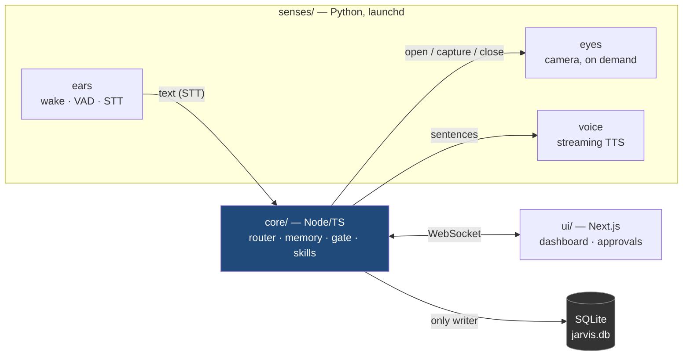
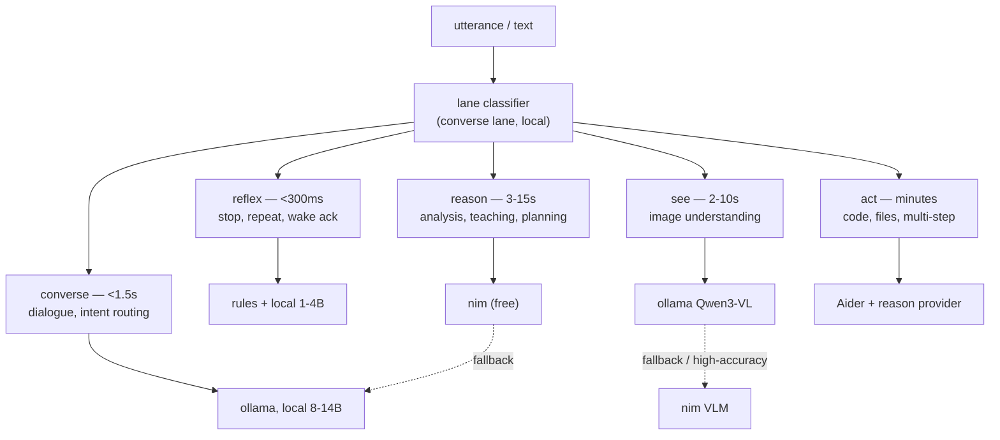
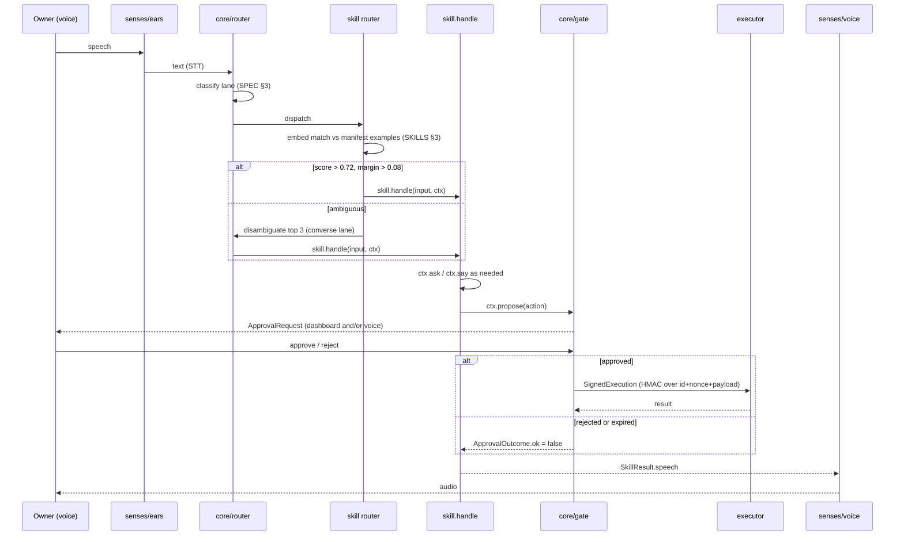
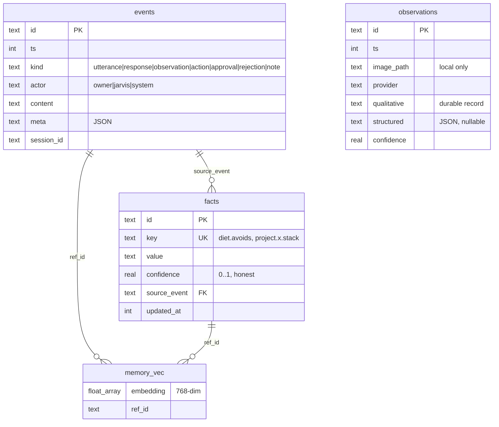
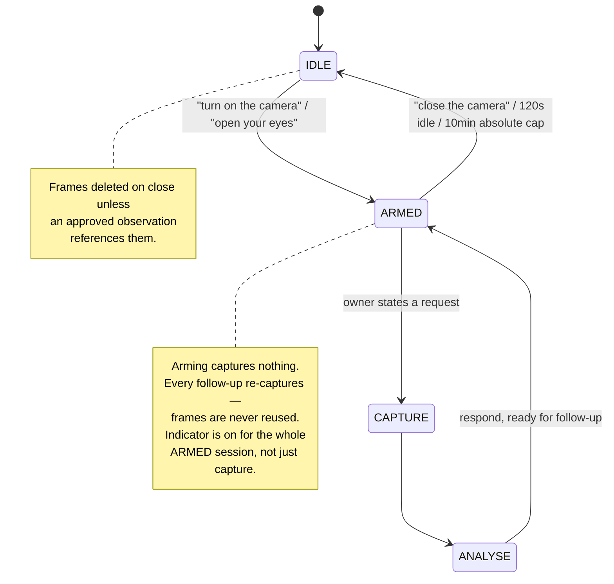
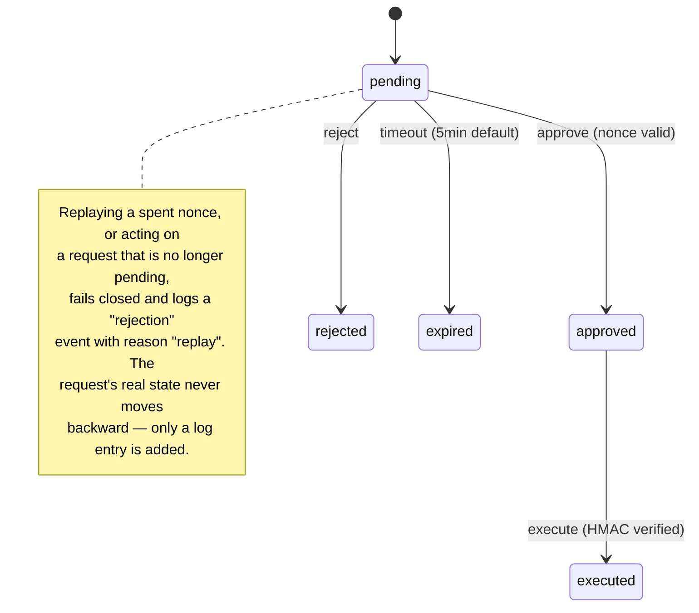
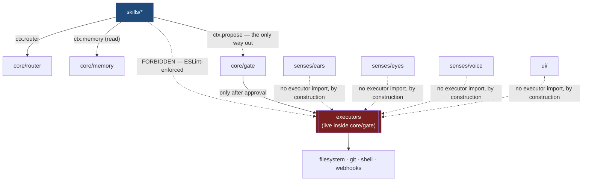
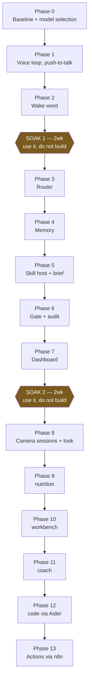
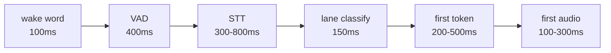

# ARCHITECTURE.md — the graph

A visual index into `SPEC.md`. Every diagram here is derived from prose that
already exists in `SPEC.md`, `ROADMAP.md`, `CLAUDE.md` or `shared/types.ts`.

**If this file and `SPEC.md` ever disagree, `SPEC.md` is right.** Fix this
file in the same commit that changes the spec — treat divergence as a bug,
the same way `shared/types.ts` treats frontend/backend type drift as a bug.

Read order for a new session is still `CLAUDE.md` → `SPEC.md` → `ROADMAP.md`
→ `PROGRESS.md`. This file does not replace that. It exists so the *shape* of
the system — what talks to what, what is allowed to import what, what state
machine a subsystem obeys — can be checked at a glance instead of
reconstructed from paragraphs every session.

---

## 1. Processes

Five processes, communicating over a local Unix socket + WebSocket. Only
`core` touches the database. `ears`, `eyes`, `voice` and `ui` cannot cause a
side effect — they hold no executor imports, by construction. See `SPEC.md`
§ 2.

---

## 2. Router lanes

The single most important component — all model access goes through it.
The `converse` lane classifies which lane a request belongs to; that
classification is the thing benchmarked hardest in Phase 0. See `SPEC.md` § 3.

Every lane keeps at least one `free-local` fallback — the system must stay
usable with no internet (ADR-008). No paid provider exists on this graph
anywhere (ADR-009); the `ModelProvider` interface has room for one, nothing
is wired.

---

## 3. Request lifecycle

The path from spoken word to executed action. This is the diagram that
matters most for not hallucinating a shortcut that skips the gate.

A skill **never** reaches `Ex` directly. `ctx.propose` is the only door out
of `skill.handle`. See § 7 below for why that boundary is enforced by lint,
not convention.

---

## 4. Memory schema

`events` is append-only and is the spine; everything else derives from it.
`observations` is kept separate because vision is unreliable by nature —
mixing it into `facts` would let a guess masquerade as a belief. See
`SPEC.md` § 4.

Recall order before any `converse`/`reason` call: last N turns → top-k
semantic matches above a similarity floor → `facts` with confidence > 0.6.
Capped — a small model with 2k tokens of *relevant* memory outperforms the
same model with 30k tokens of noise.

---

## 5. Camera session state machine

`SPEC.md` § 6 — the state machine **is** the specification, not a summary of
it. ARMED is not recording; a frame is taken only on an explicit request.

---

## 6. Gate (approval) state machine

`SPEC.md` § 8. State lives in `core`; the dashboard is a view, never an
authority.

Capability tiers that decide whether a proposal needs this loop at all —
green / yellow / red — are defined in `CLAUDE.md` § 5, not repeated here to
avoid a second copy drifting from the first.

---

## 7. Who may import whom

The rule that makes the gate meaningful: a skill can *propose*, never
*execute*. Enforced by an ESLint rule (Phase 5), not convention — this graph
is what that rule encodes.

Dashed = forbidden. If a diff ever adds one of the dashed edges for real,
that diff is wrong regardless of what it claims to be fixing.

---

## 8. Phase dependency graph

Linear by design — `ROADMAP.md` is not a backlog to reorder, it is a sequence
where each phase is proven before the next is trusted. The two SOAK phases
are not slack time; they are load-bearing.

Current position: see `PROGRESS.md`. **Never** start a box here without a
recorded "Phase N complete" for every box above it.

---

## 9. Quick lookup — concept → where it lives

| Concept | Lives in (code) | Defined in (spec) |
|---|---|---|
| `Lane`, lane budgets | `shared/types.ts` | `SPEC.md` § 3 |
| `ModelProvider` interface, registry | `core/router/` (Phase 3) | `SPEC.md` § 3 |
| Memory schema, recall policy | `core/memory/` (Phase 4) | `SPEC.md` § 4 |
| `Skill`, `SkillContext`, `SkillManifest` | `shared/types.ts`, `skills/*` | `SPEC.md` § 5, `docs/SKILLS.md` |
| Intent routing (embed match, disambiguation) | `core/skills/` (Phase 5) | `docs/SKILLS.md` § 3 |
| `Capability`, green/yellow/red tiers | `shared/types.ts` | `CLAUDE.md` § 5 |
| `ApprovalRequest` lifecycle, nonces, HMAC | `core/gate/` (Phase 6) | `SPEC.md` § 8 |
| Camera state machine | `senses/eyes/` (Phase 8) | `SPEC.md` § 6 |
| `Estimate` vs `Measurement`, quantity rule | `shared/types.ts` | `SPEC.md` § 7, ADR-011 |
| Baseline voice | `core/persona.md` | `docs/SKILLS.md` § 6 |
| Every architectural decision and why | — | `DECISIONS.md` (ADR log) |
| What's built, what's next, what surprised us | — | `PROGRESS.md` |
| Ideas explicitly not being built yet | — | `docs/BACKLOG.md` |

---

## 10. Latency budget, visually

Total budget to first audible syllable: **< 1.5 s** (`SPEC.md` § 9). This is
a Phase 1 acceptance criterion, measured, not a later optimization pass.
